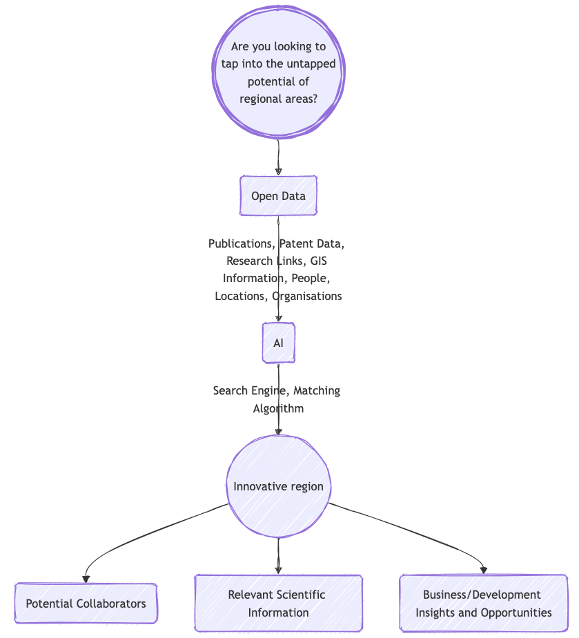

{width="100%"}

**What does [www.regioninnovation.org](https://www.regioninnovation.org) Offer?**
* Identify and match research and development (R&D) activities within regional areas and between regional and urban centers.
* Foster collaboration, transfer technology and knowledge, create synergy, and identify critical mass.
* A Geographic Information System (GIS) that locates scientific and innovative organizations and teams through papers and patents.
* An AI engine to classify technology or scientific needs with relevant R&D capability using plain English queries.
* Open and free access with limited authentication, enabling specific searches and saved reports.

**Who Can Benefit?**
* Local communities
* Regional governments
* Economic development agencies
* Federal/national governments
* Regional hubs of research and higher education organizations

**Our Goal**
* To stimulate investment to and from regional areas by supporting the identification of R&D activities and capabilities. 

**Expected Outcomes**
* Address regional challenges with targeted solutions through the development of new technologies and sustainable strategies.
* Promote inclusive development by ensuring all communities can contribute to and benefit from scientific and technological advancements.
* Drive economic development by stimulating new industries and creating rewarding jobs in regional areas.
* Enhance education and opportunities by providing access to cutting-edge research and development in local communities.
